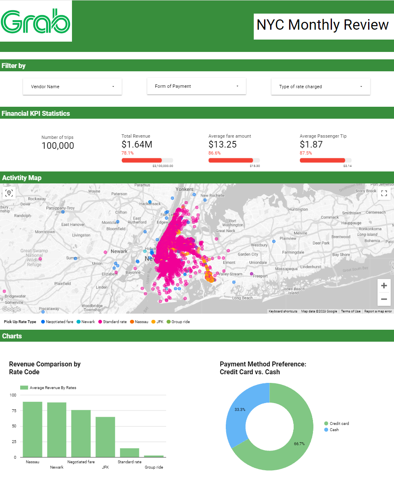
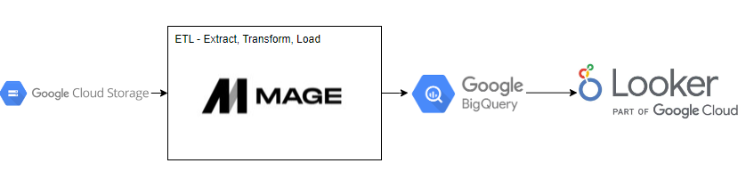

E-hailing Data Engineering Project using Google Cloud Platform

## Introduction

The objective of this project is to conduct data analysis on taxi data utilizing a range of tools and technologies, which includes Python, GCP Storage, the Mage Data Pipeline Tool, BigQuery, and Looker Studio.

Link to dashboard: https://lookerstudio.google.com/reporting/84b217f6-1282-41ce-a88f-631623a46028

## Technology Used
Python

Google Cloud Platform
1. Google Cloud Storage
2. Compute Engine: VM
3. BigQuery
4. Looker Studio

Mage Data Pipeine Tool - https://www.mage.ai/

## Dataset Used
TLC Trip Record Data
The trip records for yellow and green taxis contain fields that record pick-up and drop-off dates/times, pick-up and drop-off locations, trip distances, detailed fare information, rate categories, payment methods, and passenger counts as reported by drivers.
Website - https://www.nyc.gov/site/tlc/about/tlc-trip-record-data.page
Data Dictionary - https://www.nyc.gov/assets/tlc/downloads/pdf/data_dictionary_trip_records_yellow.pdf

## Data Architecture 

## Data Model

